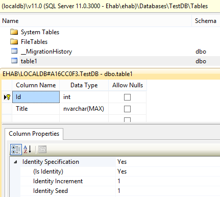

**+How it works+**

First we should build the schema for database by classes to convert it into database schema using Entity Framework, the classes must follow Entity Framework code first conventions, its simple we can build a table with few code like that:
{{
using System.ComponentModel.DataAnnotations;

public class table1
{
    public int Id { get; set; }

    [Required()](Required())
    public string Title { get; set; }
}
}}

**Note:** That convention is to look for a property named “Id” or one that combines the _class name_ (for example: class name is "Blog") and “Id”, such as “BlogId” and it's type is int. The property will map to a primary key column and identity with seed 1 and initial 1 in the database.

For more information about Entity Framework classes and data annotations:
[https://msdn.microsoft.com/en-us/data/jj591583.aspx](https://msdn.microsoft.com/en-us/data/jj591583.aspx)

* Put file(s) with class(es) with convention like mentioned in "DynamicClasses" Directory.

* By running Test function "TestCreateDll" it will create corresponding Assembly for each file and check that "table1.dll" file generated with no errors, the instruction to generate Assembly for each file is:
{{
ManageAssembly.CreateAssemblies();
}}

* Check connection string in app.config file in test application:
{{
<add name="DBConnection" connectionString="Data Source=(localdb)\v11.0;Initial Catalog=TestDB;Trusted_Connection=yes;Integrated Security=SSPI;" providerName="System.Data.SqlClient" />
}}

* Now we want to apply this model and create database, by running test "TestCreateOrUpdateDB", it will use this instruction to generate or update database:
{{
DBContext.ApplyDatabaseMigrations();
}}

* If everything is Okay we will see that the database is created and have two tables "__MigrationHistory" used by Entity Framework for updates and "table1" that is generated for us will look like:

* Now we can make transaction on "table1" for example insert a row with Title = "test1":
{{

// get table1 type from generated assembly
Type table1 = ManageAssembly.GetType("table1");

// invoke context.Set<table1>
var data = context.InvokeMethod_Set(table1);

// New instance of table1
dynamic instance = Activator.CreateInstance(table1);

// add title property
instance.Title = "Test1";

// add new
data.Add(instance);

// save to DB
context.SaveChanges();
}}
we can test that by test method named "TestInsertDataInDB"

* Finally, we can get First Title from "table1" by:
{{
// get table1 type from generated assembly
Type table1 = ManageAssembly.GetType("table1");

#region Invoke "Set" from context and then Invoke "FirstOrDefault"
// Get DBSet
dynamic data_Queryable = context.InvokeMethod_Set(table1);

dynamic data = context.Invoke_Generic("FirstOrDefault", table1, data_Queryable);
#endregion

var title = data.Title;
}}
You can also check this by running function "TestGetDataFromDB".
next [Conclusion](Conclusion.md)
